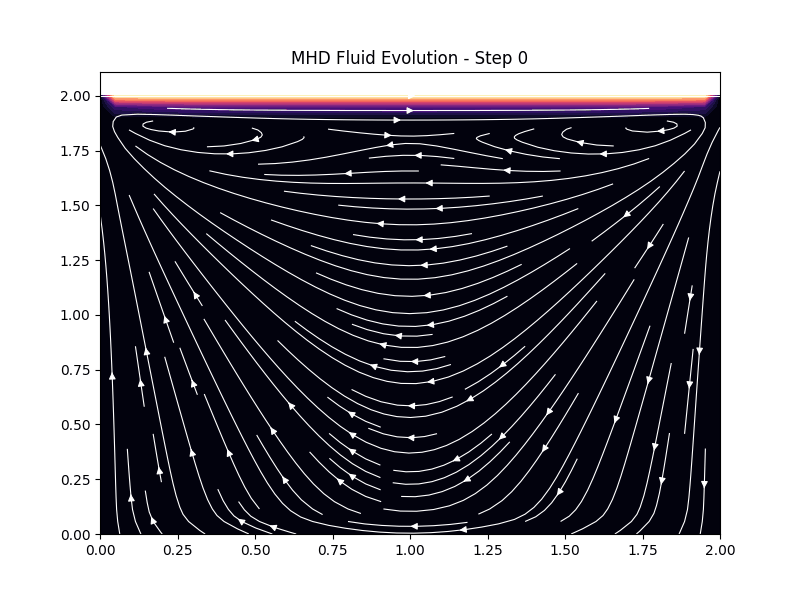

# Magnetohydrodynamic (MHD) 2D Fluid Solver

## Overview
This project implements a numerical solver for the **Navier-Stokes equations** coupled with a **Magnetic Lorentz Force** term. It simulates a "Lid-Driven Cavity" where a conductive fluid (like plasma) is influenced by an external magnetic field.

## Physics Background
The simulation solves the incompressible Navier-Stokes equations:
$$\rho \left( \frac{\partial \mathbf{u}}{\partial t} + \mathbf{u} \cdot \nabla \mathbf{u} \right) = -\nabla p + \mu \nabla^2 \mathbf{u} + \mathbf{F}_{Lorentz}$$

The inclusion of the **Lorentz Force** ($-\sigma B^2 \mathbf{u}$) acts as a magnetic brake, demonstrating how magnetic fields can suppress turbulence and modify vortex formation—a key concept in plasma physics and astrophysical fluid dynamics.

## How to Run
1. Ensure you have `numpy` and `matplotlib` installed.
2. Run `python mhd_solver.py`.
